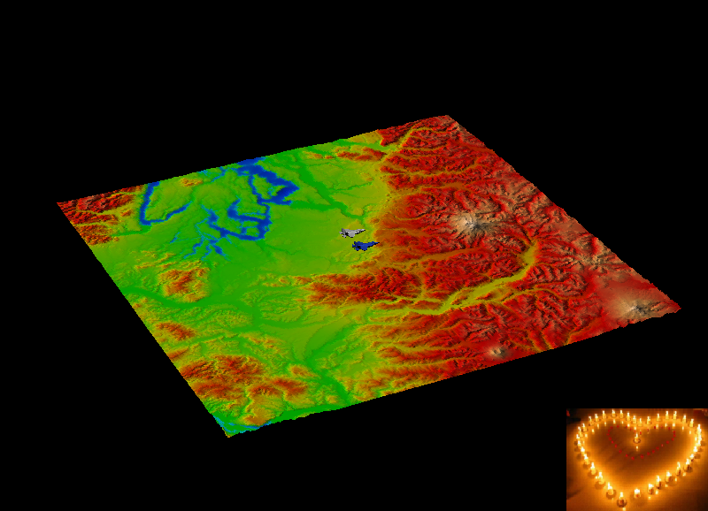
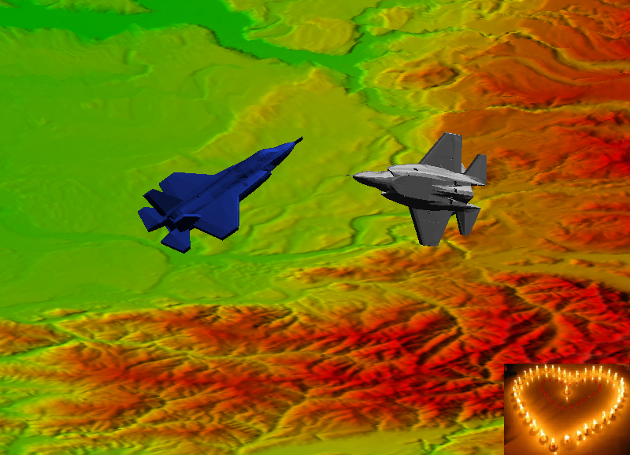

# BUAA_OpenGL_Application_Project
北航7系计算机图学实验大作业，OpenGL4.5+Qt5.15

## 玩法

### 视角控制

通过鼠标控制相机属性

-   鼠标左键控制相机位置绕世界坐标中心旋转，相机方向始终正对世界坐标中心
-   鼠标右键控制相机与世界坐标中心的距离
-   鼠标滚轮控制相机的可视角度（焦距），通过视角进行缩放

### 飞机控制

通过键盘控制飞机姿态：

-   字符侧1键：选择银色飞机
-   字符侧2键：选择蓝色飞机
-   W/S：当前飞机前进/后退（飞机坐标系）
-   A/D：当前飞机左移/右移（飞机坐标系）（当然实际飞机很难做到）
-    Q/E：当前飞机上升/下降（飞机坐标系）（当然实际飞机也很难做到）
-   ↑/↓：当前飞机俯仰角调整
-   ←/→：当前飞机偏航角调整
-   Z/X：当前飞机翻滚角调整

## 效果

